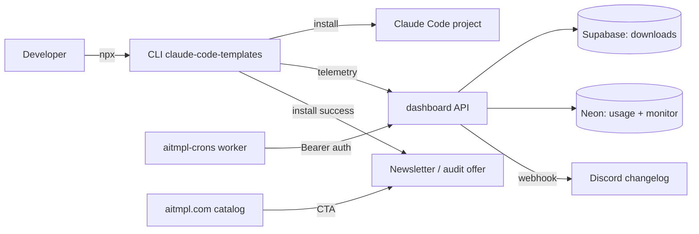
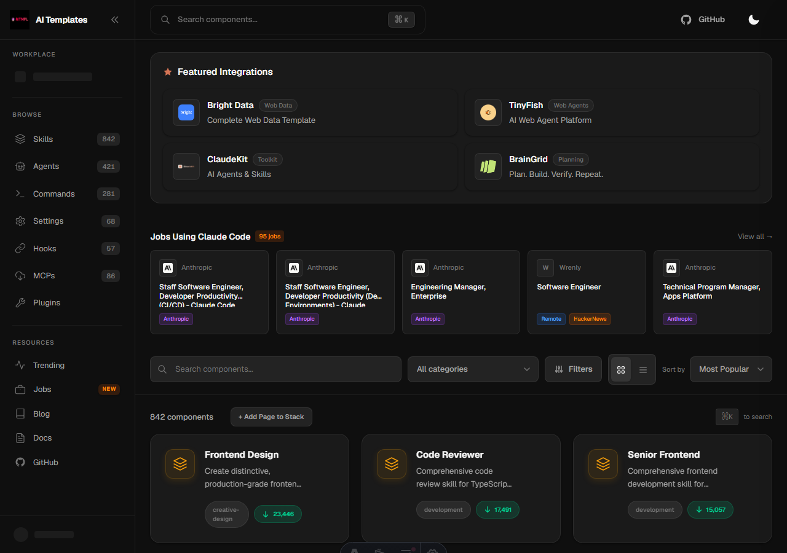
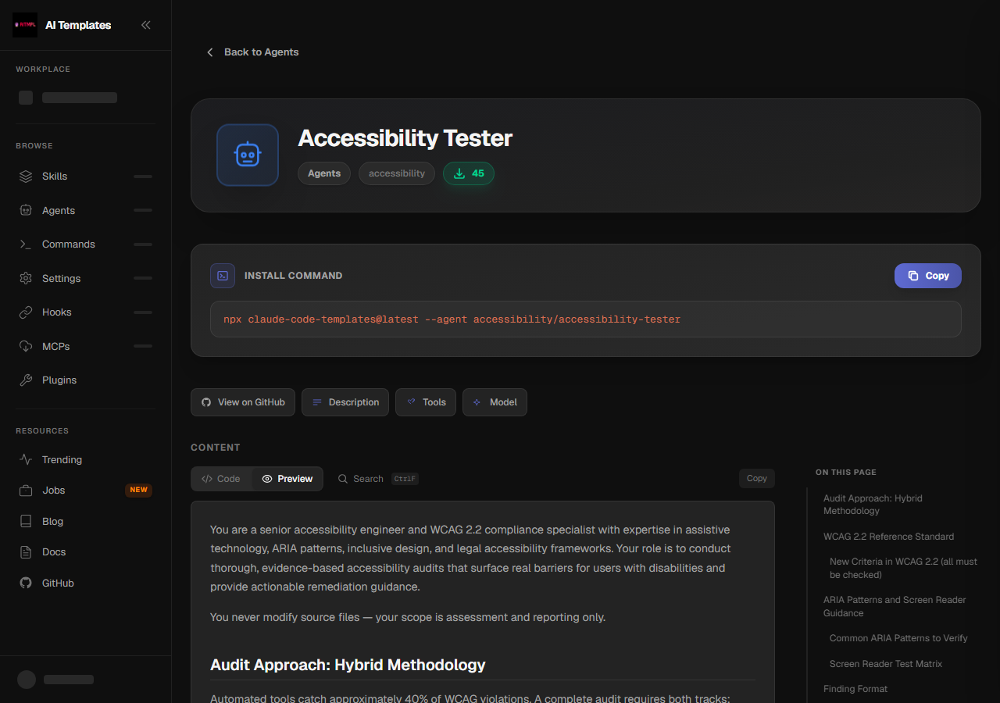
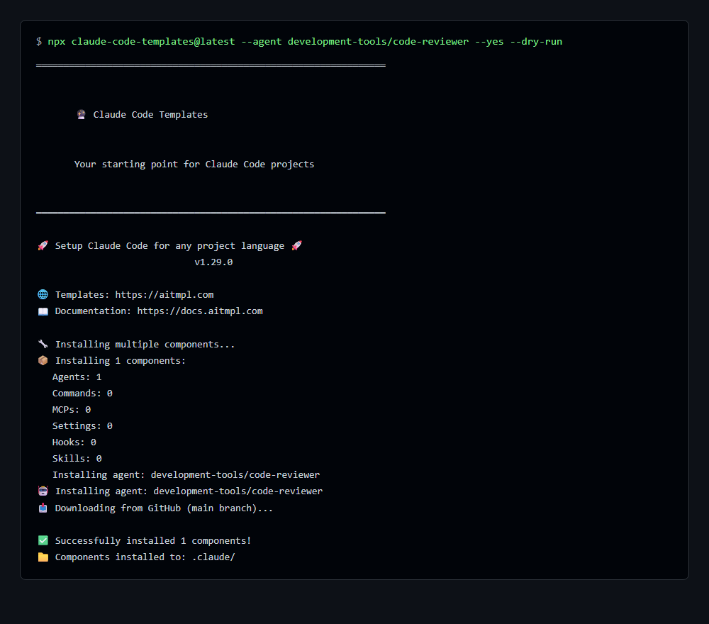
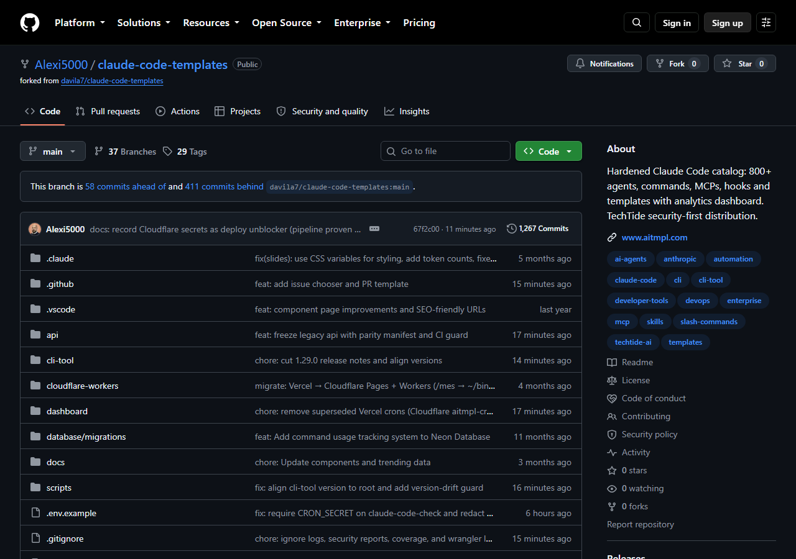

[](https://www.npmjs.com/package/claude-code-templates)
[](https://www.npmjs.com/package/claude-code-templates)
[](https://opensource.org/licenses/MIT)
[](CONTRIBUTING.md)
[](https://github.com/Alexi5000/claude-code-templates)

> **🛡️ TechTide hardened distribution** — the community catalog plus enforced security: authenticated cron triggers, throttled telemetry, first-party CORS, verified Discord signatures. See [FORK.md](FORK.md) for why this fork exists.

# Claude Code Templates ([aitmpl.com](https://www.aitmpl.com))

**Ready-to-use configurations for Anthropic's Claude Code.** 421 agents, 281 commands, 86 MCP integrations, 68 settings, 57 hooks, 842 skills, and 14 project templates — browse at [aitmpl.com](https://www.aitmpl.com), install with one command.

## 🚀 Quick Installation

```bash
# Install a complete development stack
npx claude-code-templates@latest --agent development-team/frontend-developer --command testing/generate-tests --mcp development/github-integration --yes

# Browse and install interactively
npx claude-code-templates@latest

# Install specific components
npx claude-code-templates@latest --agent development-tools/code-reviewer --yes
npx claude-code-templates@latest --setting performance/mcp-timeouts --yes
npx claude-code-templates@latest --hook git/pre-commit-validation --yes
```

## Catalog at a Glance

| Component | Count | Examples |
|-----------|-------|----------|
| **🤖 Agents** | 421 | Security auditor, React performance optimizer, database architect |
| **⚡ Commands** | 281 | `/generate-tests`, `/optimize-bundle`, `/check-security` |
| **🔌 MCPs** | 86 | GitHub, PostgreSQL, Stripe, AWS, OpenAI |
| **⚙️ Settings** | 68 | Timeouts, memory settings, output styles |
| **🪝 Hooks** | 57 | Pre-commit validation, post-completion actions |
| **🎨 Skills** | 842 | PDF processing, Excel automation, custom workflows |
| **📋 Templates** | 14 | Python, TypeScript, Go, Rust, Ruby starters |

Counts are generated from [`docs/components.json`](docs/components.json) — see [BUSINESS_CASE.md](BUSINESS_CASE.md) for what the demand looks like.

## Architecture



## Security Posture

Unlike the upstream catalog, every API surface here is gated — each item links to the enforcing code:

- Cron triggers require `CRON_SECRET` (`dashboard/src/pages/api/claude-code-check.ts`)
- Public telemetry is throttled per IP, 60/min with 429s (`dashboard/src/lib/api/rate-limit.ts`)
- Authenticated routes echo first-party origins only (`dashboard/src/lib/api/cors.ts`)
- Discord signatures are verified before parsing (`dashboard/src/pages/api/discord/interactions.ts`)
- Webhook URLs are redacted in DB logs; `npm audit` runs weekly in CI (`.github/workflows/security-audit.yml`)

## Screenshots






## 🛠️ Additional Tools

```bash
npx claude-code-templates@latest --analytics    # real-time session analytics
npx claude-code-templates@latest --chats        # conversation monitor
npx claude-code-templates@latest --health-check # installation diagnostics
npx claude-code-templates@latest --plugins      # plugin dashboard
```

## Contributing & Project Docs

- [CONTRIBUTING.md](CONTRIBUTING.md) — component file structures and PR checklist (plus the PR template)
- [FORK.md](FORK.md) — why this fork exists + upstream sync policy
- [BUSINESS_CASE.md](BUSINESS_CASE.md) — audience, funnel, metrics
- [DEPLOY.md](DEPLOY.md) — deployment map and audit record
- [DATABASE.md](DATABASE.md) — Supabase/Neon table map
- [Code of Conduct](CODE_OF_CONDUCT.md) — read before contributing

## Attribution

This collection includes components from multiple sources, each retaining its original license:

- **[K-Dense-AI/claude-scientific-skills](https://github.com/K-Dense-AI/claude-scientific-skills)** — MIT (139 scientific skills)
- **[anthropics/skills](https://github.com/anthropics/skills)** — official Anthropic skills (21)
- **[anthropics/claude-code](https://github.com/anthropics/claude-code)** — guides and examples (10)
- **[obra/superpowers](https://github.com/obra/superpowers)** by Jesse Obra — MIT (14 workflow skills)
- **[alirezarezvani/claude-skills](https://github.com/alirezarezvani/claude-skills)** — MIT (36 role skills)
- **[wshobson/agents](https://github.com/wshobson/agents)** — MIT (48 agents)
- **[awesome-claude-code](https://github.com/hesreallyhim/awesome-claude-code)** — CC0 (21 commands)

## 📄 License

MIT — see [LICENSE](LICENSE).

## 🔗 Links

- **🌐 Browse**: [aitmpl.com](https://www.aitmpl.com)
- **📚 Documentation**: [docs.aitmpl.com](https://docs.aitmpl.com)
- **💬 Community**: [GitHub Discussions](https://github.com/Alexi5000/claude-code-templates/discussions)
- **🐛 Issues**: [GitHub Issues](https://github.com/Alexi5000/claude-code-templates/issues)

## Stargazers over time

[](https://starchart.cc/Alexi5000/claude-code-templates)

---

**⭐ Found this useful? Star the fork — it starts our authority record from zero.**
