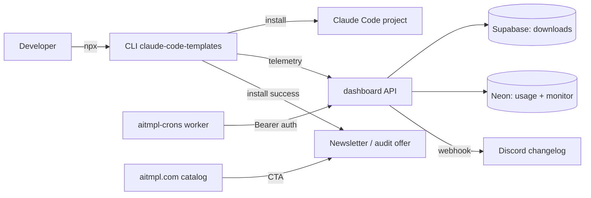

# Fork Launch Week Implementation Plan (Mon Sep 21 – Fri Sep 25, 2026)

> **For agentic workers:** REQUIRED SUB-SKILL: Use superpowers:subagent-driven-development (recommended) or superpowers:executing-plans to implement this plan task-by-task. Steps use checkbox (`- [ ]`) syntax for tracking.

**Goal:** Turn the Alexi5000 fork into a defensible, lead-generating, fully-deployed TechTide asset in five days: documented fork rationale, written business case, new README with fresh visuals, updated GitHub About, verified deployments, and full repo + document hygiene.

**Architecture:** Week runs in dependency order — fork evidence (Day 1) → code-plan execution for deploy safety (Day 2: Plans 2+3) → deployment audit + About (Day 3) → dedup/hygiene plans + README copy/diagrams (Day 4) → screenshots, doc-hygiene sweep, close-out (Day 5). Each day ends with a verifiable artifact, committed.

**Tech Stack:** git + `gh` CLI (installed), GitHub Actions, Astro dashboard, Cloudflare Pages/Workers, npm, vitest/jest (from Plans 1–3), mermaid (GitHub-native diagrams, no tooling).

## Global Constraints

- Canonical fork repo: `Alexi5000/claude-code-templates`, branch `main`. Upstream: `davila7/claude-code-templates` (no remote configured yet — Day 1 adds it read-only).
- The 5 Plan-1 security commits (`d30ab60b..164b138c`) are local-only and unpushed — pushing them is a Day 1 decision, not a default.
- `dashboard/src/pages/api/` is canonical (Plan 4). No new legacy `api/` work during the week.
- Commit style: `fix:`, `feat:`, `chore:`, `docs:` prefixes. No secrets in commits; `npm publish` / token flows stay maintainer-only.
- Plans 2–5 (in `docs/superpowers/plans/`) are pre-written and unexecuted — this week executes them; it does not rewrite them.

---

### Day 1 (Mon): Fork rationale + business case

**Files:**
- Create: `FORK.md`
- Create: `BUSINESS_CASE.md`

**Interfaces:**
- Depends on: `git` history, `gh` API (read-only).
- Produces: fork justification + upstream policy (`FORK.md`); funnel, differentiation, metrics (`BUSINESS_CASE.md`) consumed by README (Day 4) and About (Day 3).

- [ ] **Step 1: Add upstream remote (read-only) and measure divergence**

```bash
git remote add upstream https://github.com/davila7/claude-code-templates.git
git fetch upstream --prune
git rev-list --left-right --count main...upstream/main
git log --oneline upstream/main..main | head -30
```

Expected: `remote add` succeeds; the count prints as `<ahead> <behind>` (ahead ≥ 5 from the unpushed Plan-1 commits); the log lists exactly the TechTide-only commits. Copy all three outputs into `FORK.md` evidence section. Never push to `upstream` (no write credential is configured — keep it that way).

- [ ] **Step 2: Decide the fate of the 5 unpushed commits**

Run: `git log --oneline origin/main..main`

Expected: the 5 Plan-1 commits. Decision rule (record the choice in `FORK.md`): if any commit after this review still holds, `git push origin main`; if anything needs rework, open a PR from a `techtide/plan-1-hardening` branch instead of pushing direct. Do not leave them unpushed past Day 1 — every later day assumes `origin/main` includes them.

- [ ] **Step 3: Write FORK.md (full skeleton, fill numbers from Steps 1–2)**

Create `FORK.md` with exactly these sections (2–4 sentences each, numbers pasted from Step 1 output):

```markdown
# Why this fork exists

## Relationship
This repo (`Alexi5000/claude-code-templates`) is a friendly fork of
`davila7/claude-code-templates`. Upstream is the community catalog;
this fork is TechTide's hardened, lead-generating distribution.

## Evidence of divergence
- Commits ahead of upstream: <N from Step 1>
- Commits behind upstream: <N from Step 1>
- TechTide-only branches: `origin/techtide/build-out` (+ list any from `git branch -a`)
- Key differentiators: CRON-secret cron auth, per-IP telemetry throttling,
  scoped CORS, Discord signature enforcement (Plan 1, Sep 2026).

## Upstream policy
- `upstream` remote is fetch-only; CI never pushes there.
- Sync cadence: monthly `git fetch upstream` + cherry-pick catalog additions;
  never merge upstream `main` wholesale (protects the security fixes above).
- Divergent files owned by TechTide: `dashboard/src/lib/api/*`,
  `dashboard/src/pages/api/*`, `.github/workflows/security-audit.yml`.
```

- [ ] **Step 4: Pull business-case evidence (no fabrication)**

```bash
curl -s "https://api.npmjs.org/downloads/point/last-month/claude-code-templates" | node -e "let s='';process.stdin.on('data',d=>s+=d).on('end',()=>console.log(JSON.parse(s).downloads+' downloads/last-30d'))"
gh api repos/Alexi5000/claude-code-templates --jq "{stars: .stargazers_count, forks: .forks_count, open_issues: .open_issues_count}"
npm view claude-code-templates version time.modified
```

Expected: three real numbers (downloads, stars/forks/issues, latest version + date). If any call fails (auth/rate-limit), write `unavailable (<reason>)` — never invent.

- [ ] **Step 5: Write BUSINESS_CASE.md**

Create `BUSINESS_CASE.md` with exactly these sections:

```markdown
# Business case: TechTide Claude catalog (lead-gen & authority)

## Audience
Developers adopting Claude Code who need vetted agents/commands/MCPs;
engineering leaders evaluating AI-assisted delivery (TechTide's consulting buyers).

## Funnel
Catalog browse (aitmpl.com) → one-line CLI install → repeat telemetry
(track-download/command-usage) → README + dashboard CTAs → newsletter /
audit offer → consulting conversation.

## Differentiation (why ours, not upstream)
Security-hardened distribution: authenticated cron triggers, throttled
telemetry, first-party CORS, enforced Discord signatures, weekly npm audit
CI. Every claim links to a file or workflow.

## Metrics (refresh monthly, sources in parentheses)
- npm downloads/30d (npm API, Day-1 Step-4 command)
- GitHub stars/forks/open issues (`gh api`, same)
- Telemetry installs/30d (Supabase `component_downloads` count query)
- Consulting inquiries attributed to catalog (manual tag in inbox)

## CTAs to add (feeds Day 4 README work)
README header badge → audit offer; install-success message → newsletter;
dashboard footer → TechTide site. Copy drafted in README task.
```

- [ ] **Step 6: Commit**

```bash
git add FORK.md BUSINESS_CASE.md
git commit -m "docs: fork rationale and lead-gen business case"
```

---

### Day 2 (Tue): Execute Plans 2 + 3 (deploy safety prerequisites)

**Files:** Per the two plan docs; no new files here.

**Interfaces:**
- Depends on: Day 1 (origin/main current).
- Produces: patched deps + audit CI (Plan 2); real test runner + write-gated api tests (Plan 3). Both required before any deploy touch on Day 3.

- [ ] **Step 1: Execute `2026-09-18-dependency-patch-audit-ci.md` end-to-end (Tasks 1–4)**

Follow its red→green steps verbatim. Stop conditions: `npm audit --audit-level=high` must exit 0 in all four units before the workflow commit; the legacy `verifyKey` inspection (Task 3) must end in either an `await` fix or a written `already-awaited` finding.

- [ ] **Step 2: Execute `2026-09-18-real-test-coverage.md` end-to-end (Tasks 1–5)**

Follow its steps verbatim, noting its internal order (Task 4 before committing Task 1). Stop conditions: root `npm test` exits 0; `test:e2e` has a real test; api suite skips live writes by default; dashboard deploy gate added.

- [ ] **Step 3: Day-2 verification**

```bash
npm test 2>&1 | tail -3
npm --prefix dashboard test 2>&1 | grep -E "Test Files|Tests "
git log --oneline -12
```

Expected: root suite green; dashboard files+tests counts printed; log shows the Plan-2/3 commits on top of Day-1 work. Any red here blocks Day 3 — fix forward, do not carry breakage.

---

### Day 3 (Wed): Deployment audit → decision → About

**Files:**
- Create: `DEPLOY.md` (audit table + targets + owners)

**Interfaces:**
- Depends on: Day 2 (green suites, audit CI live).
- Produces: `DEPLOY.md` consumed by Day-4/5 verify steps; GitHub About updated same day.

- [ ] **Step 1: Run the deployment audit (record every output)**

```bash
curl -s -o /dev/null -w "dashboard root: %{http_code}\n" https://www.aitmpl.com/
curl -s -o /dev/null -w "health-check: %{http_code}\n" https://www.aitmpl.com/api/health-check
curl -s -o /dev/null -w "components.json: %{http_code}\n" https://www.aitmpl.com/components.json
npm view claude-code-templates version
npx --yes wrangler pages deployment list --project-name=aitmpl-dashboard 2>&1 | head -8
gh api repos/Alexi5000/claude-code-templates --jq "{default_branch: .default_branch, homepage: .homepage}"
```

Expected: three HTTP codes, an npm version, wrangler output or a clear auth error, repo metadata. Paste all outputs into the `DEPLOY.md` audit table — `unavailable (<reason>)` where a credential is missing; request it same-day.

- [ ] **Step 2: Write DEPLOY.md with the decision**

```markdown
# Deployment map

## Audit (date + outputs from Step 1 table)
| Surface | URL / target | Status code | Owner |
|---|---|---|---|
| Dashboard + APIs | https://www.aitmpl.com | <code> | <name> |
| Static JSON | /components.json, /trending-data.json | <code> | <name> |
| Crons worker | aitmpl-crons (Cloudflare) | <deploys?> | <name> |
| npm CLI | claude-code-templates@<version> | <version> | <name> |
| Discord bot | interactions endpoint | <verified?> | <name> |

## Decision
Targets confirmed for this week: <list>. Explicitly deferred: <list + reason>.
Each target gets a verify command (same curl/npm/wrangler lines as Step 1).
```

- [ ] **Step 3: Execute the fix list, target by target**

For each target marked down/broken in Step 1: fix via the owning workflow (`deploy.yml` for dashboard, `publish-package.yml`/maintainer token flow for npm, `wrangler deploy` from the worker dir for crons), then rerun its Step-1 verify command until green. One commit per target fix; never batch unrelated deploy fixes.

- [ ] **Step 4: Update the GitHub About section**

```bash
gh repo edit Alexi5000/claude-code-templates --description "Hardened Claude Code catalog: 800+ agents, commands, MCPs, hooks & templates with analytics dashboard — TechTide's security-first distribution" --homepage "https://www.aitmpl.com"
gh repo edit Alexi5000/claude-code-templates --add-topic claude-code --add-topic ai-agents --add-topic mcp --add-topic slash-commands --add-topic developer-tools --add-topic automation --add-topic anthropic --add-topic cli
gh api repos/Alexi5000/claude-code-templates --jq "{description, homepage, topics}"
```

Expected: the final `gh api` echoes the new description, homepage, and 8 topics. Screenshot the repo header for Day-4 README use.

- [ ] **Step 5: Commit**

```bash
git add DEPLOY.md
git commit -m "docs: deployment audit, targets, and fix record"
```

---

### Day 4 (Thu): Execute Plans 4 + 5, README copy + diagrams

**Files:**
- Modify: `README.md` (full rewrite, 162 lines → new structure below)
- Per Plan 4/5 docs for their files.

**Interfaces:**
- Depends on: Days 1–3 (numbers for README stats, live URLs verified, About set).
- Produces: new README copy + mermaid diagrams (images land Day 5).

- [ ] **Step 1: Execute `2026-09-18-api-dedup-deploy-clarity.md` (Tasks 1–4)**

Stop conditions: `bash scripts/sync-api.sh` green + negative check demonstrated; `vercel.json` has no `crons` key; `DATABASE.md` exists (note: plan predicted it MISSING — it now gets created here); `bash scripts/check-versions.sh` green.

- [ ] **Step 2: Execute `2026-09-18-repo-hygiene-release-readiness.md` (Tasks 1–4)**

Stop conditions: dead files gone + suite green; `git check-ignore` proves new rules; templates validate; versions at `1.29.0` with CHANGELOG section (no tag/publish — maintainer follow-up stands).

- [ ] **Step 3: Rewrite README.md with this exact structure**

Keep all existing badges; then these sections in order (copy drafts the funnel + differentiators from `BUSINESS_CASE.md`, stats from Day-1 Step 4, URLs from `DEPLOY.md`):

1. One-line pitch + audit-offer badge/CTA (header)
2. `## Quick install` (3 copy-paste commands, verified against current CLI flags)
3. `## Catalog at a glance` (table: agents/commands/MCPs/settings/hooks/skills + counts from `docs/components.json`)
4. `## Architecture` (mermaid diagram — block below)
5. `## Security posture` (5 Plan-1 items, one line each with file links)
6. `## Screenshots` (image placeholders pointing at `docs/assets/*.png` — files land Day 5; use exact filenames from Step 5 so nothing breaks)
7. `## Contributing / Business` (link `CONTRIBUTING.md`, `FORK.md`, `BUSINESS_CASE.md`, newsletter + audit CTAs)

Mermaid block (paste verbatim):



- [ ] **Step 4: Reserve exact screenshot filenames**

`docs/assets/dashboard-home.png`, `docs/assets/component-page.png`, `docs/assets/cli-install.png`, `docs/assets/about-header.png` (Day-3 screenshot). Reference exactly these four in README; Day 5 captures them 1:1.

- [ ] **Step 5: Commit**

```bash
git add README.md
git commit -m "docs: rewrite README around lead-gen funnel with architecture diagram"
```

(Build will show broken-image icons until Day 5 — expected, noted in commit body.)

---

### Day 5 (Fri): Screenshots, doc hygiene, close-out

**Files:**
- Create: `docs/assets/*.png` (4 files)
- Modify: any doc fixed by the hygiene sweep.

**Interfaces:**
- Depends on: Day 4 (filenames reserved, deploys green so screenshots show the live product).
- Produces: complete README; hygiene report; week-close verification.

- [ ] **Step 1: Capture the four screenshots**

Serve locally (`npm --prefix dashboard run dev`, http://localhost:4321) or use the live site from `DEPLOY.md`; capture: catalog home, one component page, one terminal CLI install run, the GitHub About header (Day-3 file). Save to the exact four paths from Day 4 Step 4 at ≥1280px width. Verify: `node -e "['docs/assets/dashboard-home.png','docs/assets/component-page.png','docs/assets/cli-install.png','docs/assets/about-header.png'].forEach(f=>console.log(require('fs').existsSync(f)?'OK '+f:'MISSING '+f))"` prints four `OK` lines.

- [ ] **Step 2: Run the document-hygiene sweep**

```bash
node -e "const fs=require('fs'),path=require('path');const docs=['README.md','FORK.md','BUSINESS_CASE.md','DEPLOY.md','DATABASE.md','CLAUDE.md','CONTRIBUTING.md','CHANGELOG.md','.env.example'];const miss=[];for(const f of docs){if(!fs.existsSync(f))miss.push(f)}console.log(miss.length?'MISSING: '+miss.join(', '):'all docs present');const rel=/\]\((?!https?:|#|mailto:)([^)]+)\)/g;const broken=[];for(const f of docs){if(!fs.existsSync(f))continue;const s=fs.readFileSync(f,'utf8');let m;while((m=rel.exec(s))){const t=m[1].split('#')[0];if(t&&!fs.existsSync(path.join(path.dirname(f),t)))broken.push(f+': '+m[1])}}console.log(broken.length?'BROKEN LINKS:\n'+broken.join('\n'):'no broken relative links')"
node -e "const s=require('fs').readFileSync('.env.example','utf8');for(const k of ['CRON_SECRET','SUPABASE_URL','NEON_DATABASE_URL','DISCORD_PUBLIC_KEY','CLERK_SECRET_KEY']){console.log((s.includes(k+'=')?'OK ':'MISSING ')+k)}"
```

Expected: all docs present; zero broken relative links; all five env keys present. Fix every hit in the same commit (link target or `.env.example` line, exact).

- [ ] **Step 3: Stale-reference sweep**

Search all markdown for `davila7/claude-code-templates` outside `FORK.md` (where it is correct context) and for any pre-fork absolute URLs that now 404; repoint to the fork or the live deploy URLs from `DEPLOY.md`. Verify with a second pass showing zero remaining hits outside `FORK.md`.

- [ ] **Step 4: Decide the plans' fate + final verification**

Decide: commit `docs/superpowers/plans/` (recommended — audit trail) or leave untracked; record the decision in the close-out commit body either way. Then run the full matrix and paste results into the commit body:

```bash
npm test 2>&1 | tail -2
npm --prefix dashboard test 2>&1 | grep -E "Test Files|Tests "
bash scripts/sync-api.sh && bash scripts/check-versions.sh
curl -s -o /dev/null -w "site: %{http_code}\n" https://www.aitmpl.com/
git log --oneline -5 && git status --short
```

- [ ] **Step 5: Close-out commit**

```bash
git add -A docs README.md FORK.md BUSINESS_CASE.md DEPLOY.md DATABASE.md CLAUDE.md CONTRIBUTING.md CHANGELOG.md .env.example
git commit -m "docs: week close-out — screenshots, hygiene sweep, verification matrix in body"
```

---

## Execution order (no parallel tracks — each day gates the next)

Day 1 → Day 2 → Day 3 → Day 4 → Day 5. If a day slips, move whole days (never compress verification steps). Stretch goal only if all five days are green early: dashboard About page linking `FORK.md`/`BUSINESS_CASE.md`.
